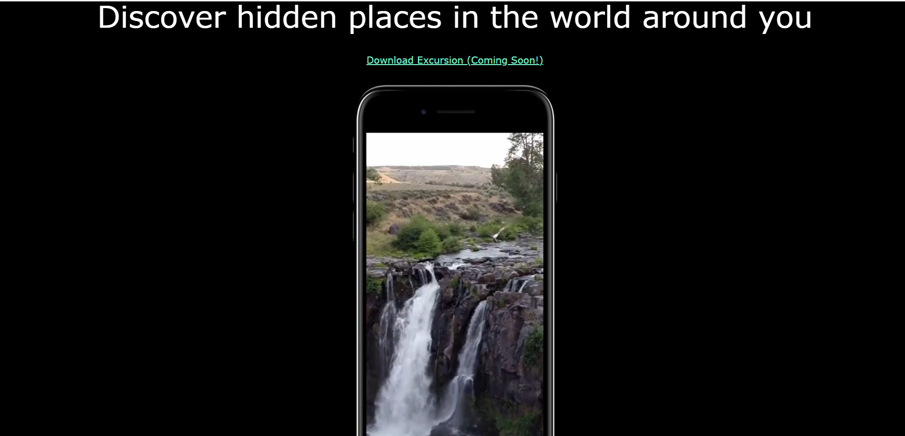

# Project's Title: Excursion
#### The aim of the project: to create a web page which advertises a product called “Excursion.” 
## Table of contents:
* [General info](#general-info)
* [Technologies](#technologies)
* [Screenshot](#screenshot)
* [Launch](#launch)
* [Sources](#sources)

## General info:
* This project is part of Codecademys Full-Stack Engineering Path.

## Technologies:
* HTML
* CSS
* Markdown
* Command Line Interface
* Git
* GitHub
* Visual Studio Code 1.63.0

## Screenshot:

## Launch:
Click on [the link](https://20dom21.github.io/excursion/).

## Sources:
* Design mock: https://content.codecademy.com/programs/freelance-one/excursion/mocks/excursion.png
* Redline mock: https://content.codecademy.com/programs/freelance-one/excursion/mocks/excursion_redline.png
